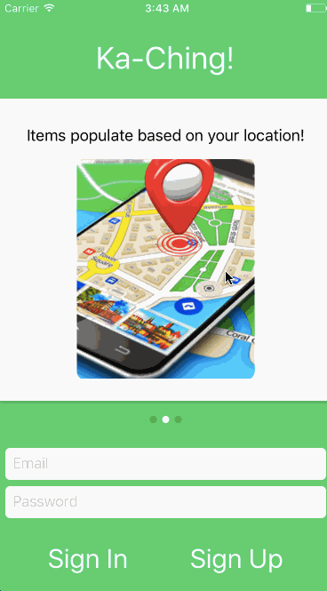

# Ka-Ching

[Ka-Ching Demo Page][Ka-Ching]


Ka-Ching is a mobile application. It allows users to post, sell, and buy items.

This project was blueprinted and created with a 7 day deadline using React Native, Node.js, Express, Mongo Database, Mongoose.

Ka-Ching is a collaborative project created by:

Howard Feger - [Github Link](https://github.com/hfeger4)  
Joey Jirasevijinda - [Github Link](https://github.com/joeyjira)  
Geewon Lee - [Github Link](https://github.com/gwlee1991)  
Terrence Tang - [Github Link](https://github.com/Ttang8)  

## Technology

Ka-Ching was built using the industry standard MERN stack(MongoDB/Express/React/Node.js).  Node.js, Express, and Mongoose are used on the back-end. Node.js is a server framework written in JavaScript. Express and Mongoose help build a RESTful API to define the routes for the application. MongoDB as a database in conjunction with Express, and Node handle the data storage. React Native is a front-end framework for building on the mobile platform building off of React and JavaScript for its reusable modular code along. Redux cycle was used with React Native to provide a unidirectional data flow.

## Features & Implementation

- Secure front-end and back-end user authentication.
- Ability to upload items to sell or remove from posting.
- Ability to add items to interest list to buy items from seller.
- Click items to see item details.
- Explore what other users are posting in an index page.

### Secure Login / Edit User

Login/Signup with email and password. Password is not stored and user is tracked via token.


### Selling Items / Items Index

Items are posted and saved with geolocation so that only users near the area can see the posted items.

```JavaScript
//UploadItem.js

navigator.geolocation.getCurrentPosition((pos)=>{
 this.latitude = pos.coords.latitude;
 this.longitude = pos.coords.longitude;
});

//ItemSubmitForm.js

handleSubmit() {
  let newItem = {
    title: this.state.itemInfo.title,
    description: this.state.itemInfo.description,
    price: this.state.itemInfo.price,
    geometry: { type: 'Point', coordinates: [this.props.navigation.state.params.itemInfo.region.longitude, this.props.navigation.state.params.itemInfo.region.latitude]},
    seller: this.props.user.user_id
  };

  let position = this.userPosition;
  this.props.createItem(newItem, position)
    .then(this.props.fetchItems(this.userPosition))

    .then(()=> this.props.navigation.navigate('UserProfileContainer'));
}

//items.js

navigator.geolocation.getCurrentPosition((pos)=>{
  this.latitude = pos.coords.latitude;
  this.longitude = pos.coords.longitude;
  this.userPosition = {
    lat: this.latitude,
    lng: this.longitude
  };

  this.props.fetchItems(this.userPosition)
  .then(response => {
    this.setState({
      items: response.items.data
    });
  });
});
this.props.fetchUser(this.props.auth.user_id);

```


### Add Interests

Users can add items from the index to interests page to buy later.


### React Navigation
Using React Navigation, Ka-Ching can offer seamless navigation between its components. This proved difficult because React Navigation requires a lot of planning to set up the component routes. It also requires that you configure the stacks needed for navigation.
```ruby
import React from 'react';
import { TabNavigator, StackNavigator } from 'react-navigation';
import Icon from 'react-native-vector-icons/Octicons';

import Main from '../components/Main';
import InterestSwipe from '../components/swiper_components/interests';
import ItemSwipe from '../components/swiper_components/items';
import UserSwipe from '../components/swiper_components/user_profile';

import UserProfileContainer from '../components/user/UserProfileContainer';
import Items from '../components/item/items';
import InterestContainer from '../components/interest/Interest_container';
import EditUserContainer from '../components/user/EditUserContainer';
import EditUserSettingContainer from '../components/user/EditUserSettingContainer';

import Map from '../components/map/map';
import ItemSubmitFormContainer from '../components/photo/ItemSubmitFormContainer';
import Photo from '../components/photo/photo';
import UploadItem from '../components/photo/UploadItem';

import ItemShow from '../components/item/itemShow';

export const Tabs = TabNavigator({
  UserProfileContainer: {
    screen: UserProfileContainer,
    navigationOptions: {
      tabBarLabel: 'Profile',
      tabBarIcon: () => <Icon name='person' size={35} color='black'/>
    }
  },
```


### React Swiper
React Swiper detects and triggers touch events for swiping left and right rendering several components on a single page.
```ruby
<Swiper style={styles.wrapper} index={0} loop={false} activeDotColor={'white'} showsButtons={false}>
  <View style={styles.slide1}>
    <UserGreeting/>
  </View>
  <View style={styles.slide2}>
    <UserGreeting2/>
  </View>
  <View style={styles.slide3}>
    <UserGreeting3/>
  </View>
</Swiper>
```



### React Native Maps
React Native Maps allows items to be put up for sale based on their geo-location.
```ruby
<MapView region={this.state.region}
         onRegionChange={this.onRegionChange}
         style={styles.map}
         showsUserLocation={true}
         loadingEnabled={true}>
  <MapView.Marker coordinate={{
    latitude: this.state.region.latitude,
    longitude: this.state.region.longitude
  }}/>
```


### Future Direction for Project
In the future we plan to implement notifications of new items, categories to search items, chat between seller and buyer, a cart to purchase items, the ability to add photos to items, and the ability to search for items.

[Ka-Ching]:https://ttang8.github.io/Ka-Ching/
